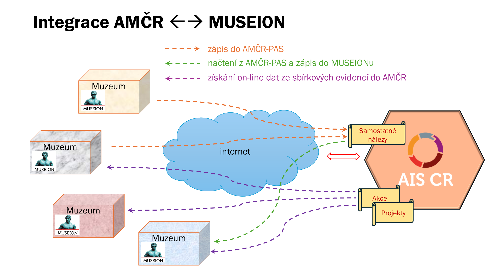

::: callout-note

Digitální archiv AMČR je dostupný na stránce [https://digiarchiv.aiscr.cz/](https://digiarchiv.aiscr.cz/){.external}.
Informace pro muzea, která chtějí svá data poskytovat, najdete v části [Dohody o využívání AMČR](/metodika/dohody.qmd#museion).

:::

Digitální archiv AMČR umí u projektů, akcí a samostatných nálezů zobrazit předměty, které k danému záznamu evidují muzea ve svém systému pro správu sbírek MUSEION společnosti Axiell.
Údaje se načítají on-line přímo ze sbírkové evidence napojených muzeí, a to v okamžiku, kdy si je zobrazíte.
Jde o jeden ze scénářů integrace AMČR a MUSEIONu, v dokumentaci obou systémů označovaný jako **scénář S6** (získání dat ze sbírkové evidence dle AMČR ID).

AMČR přitom nezískává údaje o všech předmětech v muzejních sbírkách, ale jen o těch, u nichž muzeum v MUSEIONu uvedlo identifikátor AMČR -- projektu, akce nebo samostatného nálezu.

## Kde údaje z muzeí najdete

### Tlačítko u záznamu

U projektu, akce nebo samostatného nálezu, ke kterému eviduje předměty alespoň jedno napojené muzeum, se mezi akcemi záznamu zobrazí tlačítko s ikonou muzea <svg xmlns="http://www.w3.org/2000/svg" viewBox="0 0 24 24" width="1.1em" height="1.1em" fill="currentColor" role="img" aria-label="ikona muzea" style="vertical-align:-0.15em"><path d="M22,11V9L12,2L2,9v2h2v9H2v2h20v-2h-2v-9H22z M16,18h-2v-4l-2,3l-2-3v4H8v-7h2l2,3l2-3h2V18z"/></svg> a nápovědou `Zobrazit evidované předměty v napojených systémech Museion`.
Tlačítko je dostupné ve výsledcích vyhledávání i v detailu záznamu.

U ostatních záznamů se tlačítko nezobrazuje.
Seznam záznamů, ke kterým muzea předměty evidují, se v Digitálním archivu pravidelně obnovuje, takže nově propojený záznam se může u tlačítka projevit s určitým zpožděním.

### Filtr „Evidované v Museion"

V liště nad výsledky vyhledávání (vedle tlačítek pro export a oblíbené) je ikona muzea <svg xmlns="http://www.w3.org/2000/svg" viewBox="0 0 24 24" width="1.1em" height="1.1em" fill="currentColor" role="img" aria-label="ikona muzea" style="vertical-align:-0.15em"><path d="M22,11V9L12,2L2,9v2h2v9H2v2h20v-2h-2v-9H22z M16,18h-2v-4l-2,3l-2-3v4H8v-7h2l2,3l2-3h2V18z"/></svg> s nápovědou `Evidované v Museion`.
Jejím zapnutím omezíte výsledky jen na záznamy, ke kterým napojená muzea evidují předměty.
Aktivní filtr se zobrazí mezi použitými filtry, odkud ho lze křížkem opět odebrat.

## Stránka s předměty

Po kliknutí na tlačítko se v **nové záložce prohlížeče** otevře stránka `Předměty evidované k záznamu` s identifikátorem daného záznamu.

- **Správce sbírky** -- rozbalovací nabídka muzeí, která k záznamu vrátila nějaké předměty.
  Pokud jich je více, přepnutím v nabídce zobrazíte předměty jiného muzea.
  V nabídce jsou jen muzea, která pro daný záznam skutečně nějaká data vrátila.
- **Počty** -- vedle nabídky se zobrazuje `Počet evidenčních čísel v pomocné evidenci` a `Počet inventárních čísel v systematické evidenci` vybraného muzea.
- **Tabulka předmětů** -- jeden řádek odpovídá jednomu předmětu, a to z pomocné i ze systematické evidence muzea.
  Po najetí myší na záhlaví sloupce se zobrazí vysvětlení, co daný údaj obsahuje.

Pokud žádné napojené muzeum k záznamu data nevrátí, zobrazí se hláška `Záznam se nepodařilo najít.`
Stejně se projeví i situace, kdy je systém muzea právě nedostupný -- takové muzeum se v nabídce jednoduše neobjeví.

## Proč jsou některé řádky téměř prázdné (BASIC a FULL)

O tom, jaké údaje o svých předmětech poskytne, rozhoduje **muzeum**, a to pro každý záznam předmětu zvlášť.
Rozlišují se dvě úrovně přístupu:

| Úroveň | Co se zobrazí |
|--------|---------------|
| `FULL` | Vybrané odborné údaje o předmětu, např. fond, sbírka, označení, popis, datace, materiál, technika, rozměry, nálezové okolnosti a kontext. |
| `BASIC` | Pouze evidenční, resp. inventární číslo; muzeum, které předmět spravuje, je uvedeno v nabídce `Správce sbírky`. |

Podle toho se mění i podoba tabulky:

- Poskytuje-li vybrané muzeum k záznamu **alespoň jeden předmět v úrovni FULL**, zobrazí se úplná tabulka a jejím prvním sloupcem je `Přístup` s úrovní každého předmětu.
  Předměty v úrovni BASIC mají v takové tabulce vyplněné jen číslo a ostatní buňky zůstávají prázdné.
- Jsou-li **všechny předměty v úrovni BASIC**, zobrazí se zjednodušená tabulka s jediným sloupcem `Evidenční číslo`.

Prázdné buňky tedy neznamenají chybějící nebo ztracená data, ale rozhodnutí muzea, v jakém rozsahu údaje o daném předmětu zpřístupní.

## Na co pamatovat

- **Fotografie se nepřenášejí.**
  Stránka zobrazuje pouze textovou tabulku údajů.
  Fotografie předmětů se do AMČR dostávají jen tehdy, když muzeum nález z MUSEIONu exportuje do [AMČR-PAS](/amcr/amcr-pas/index.qmd); takový záznam se pak řídí stejnými pravidly jako jakýkoli jiný záznam AMČR-PAS.
- **Nearchivované záznamy vyžadují přihlášení.**
  Tlačítko se zobrazuje u záznamu, který v Digitálním archivu vidíte.
  U záznamů, které dosud nejsou archivované, se proto musíte do Digitálního archivu přihlásit; použijete k tomu stejné přihlašovací údaje jako do AMČR.
- **Údaje patří muzeu.**
  Zobrazují se v podobě, v jaké je muzeum eviduje v okamžiku načtení; jejich opravy a doplnění je třeba řešit s příslušným muzeem.
