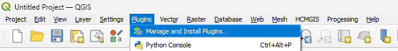
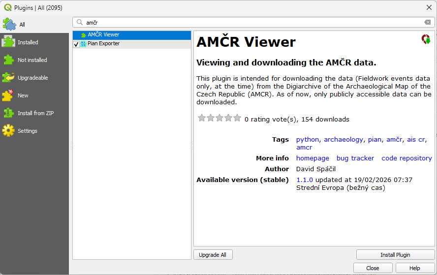
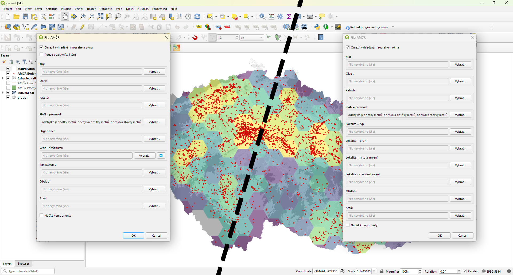
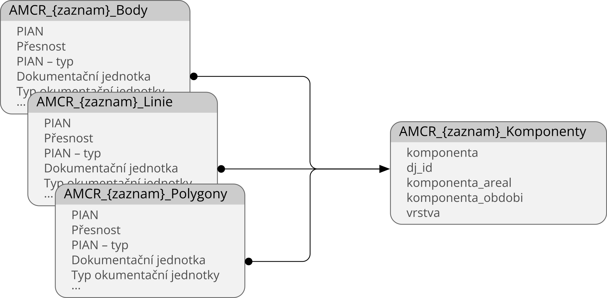
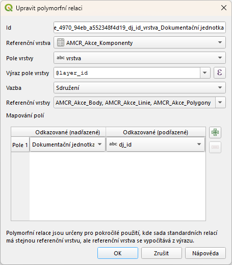

Cílem níže popsaných postupů je představit fungování QGIS pluginu [AMČR Viewer](https://plugins.qgis.org/plugins/amcr_viewer/){.external}, který slouží ke stahování archivovaných dat z **AMČR** a jejich zobrazení v prostředí **QGIS**.
Standardní možností exportu archivovaných dat z AMČR je využívání exportního dialogu Digiarchivu AMČR (viz [Hromadné sklízení prostorových dat Digitálního archivu AMČR pro GIS](https://zenodo.org/records/11490822){.external}). 
AMČR Viewer, stejně jako exportní okno, čerpá data z API Digiarchivu, nabízí ovšem jejich přímější implementaci a podrobnější metadata.


## Instalace pluginu

Nejjednodušším způsobem je instalace přímo přes repozitář pluginů QGIS. 

1. V hlavním menu v horní části okna QGIS otevřete nástroj `Plugins` → `Manage and Install Plugins...`.

[{width="66%" fig-align="center"}](figs/qv-plugins.png)

2. Vyhledejte `AMČR Viewer` a nainstalujte jej kliknutím na tlačítko `Install Plugin`.

[{width="60%" fig-align="center"}](figs/qv-install.png)

V prostředí QGIS se plugin zobrazí v podobě ikony {width="2.4%"}.


## Použití pluginu

Plugin umožňuje **načítání dat o *archeologických záznamech* (*akcích* a *lokalitách*)** a záznamech s nimi souvisejících (*PIAN*ech, *dokumentačních jednotkách* a *komponentách*). 
Základním prvkem je pro plugin ***[dokumentační jednotka](/slovnik/index.qmd#dokumentační-jednotky)***, součást *[archeologické akce](/slovnik/index.qmd#akce)* či *[lokality](/slovnik/index.qmd#lokality)*, která slouží jako unikátní záznam jak ve vztahu k *akci*/*lokalitě*, tak k příslušnému *[PIAN](/slovnik/index.qmd#pian)* (více k datové struktuře AMČR viz [Datový model](/o-systemu/datovy-model.qmd#evidence-archeologických-akcí)). 
Podobně jako v Digiarchivu lze i v pluginu filtrovat výsledky jak prostorově, tak pomocí metadat samotného archeologického záznamu, ale i jemu podřízených záznamů (zejména metadat *[komponenty](/slovnik/index.qmd#komponenty)*, jako jsou datace a typ areálu). 

### Postup načítání dat

Základní postup užívání AMČR Viewer je následující:

1. Ke spuštění pluginu slouží dvojice tlačítek `Stáhnout data akcí` {width="2.4%"} a `Stáhnout data lokalit` {width="2.4%"}, která by se měla po instalaci automaticky zobrazit v jedné z horních nástrojových lišt QGIS v podobě rozevíratelné nabídky. Pokud se tak nestalo, je možné plugin spustit z hlavního menu: `Plugins` → `AMČR Viewer` → `AMČR Viewer`.

2. Otevřené okno `Filtr AMČR` slouží k filtrování dat před jejich stažením. Je možné filtrovat pomocí:
    a) prostorových informací:
        - `Kraj`, `Okres`, `Katastr` (lze vybrat více možností),
        - `Omezit vyhledávání rozsahem okna` (tato možnost je ve výchozím nastavení vybrána z důvodu předejití neúmyslného načítání velkého množství dat),
        - `PIAN přesnost` (ve výchozím nastavení je zakázána možnost `poloha podle katastru`; lze vybrat více možností);
    b) údajů podmíněných typem dotazovaného záznamu:
        - administrativních informací:
            - `Organizace`, `Typ výzkumu` (lze vybrat více možností),
            - `Vedoucí výzkumu` (v čisté instalaci pluginu je seznam vedoucích prázdný a je třeba jej naplnit daty z API pomocí tlačítka 🔄, stejným způsobem lze seznam vedoucích i průběžně aktualizovat; lze vybrat více možností);
        - informací o lokalitě:
            - `Typ`, `Druh`, `Jistota určení`, `Stav dochování` (lze vybrat více možností);
    c) informací o nálezu:
        - `Pouze pozitivní zjištění` (relevantní pouze pro filtr *akcí*; vrátí pouze dokumentační jednotky, jejichž atribut `typ zjištění` = `pozitivní`),
        - `Období`, `Areál` (lze vybrat více možností).
    - Poslední možností dialogu je checkbox `Načíst komponenty`, který je ve výchozím nastavení vypnutý.

[{width="66%" fig-align="center"}](figs/qv-usage.png)

3. Po potvrzení výběru dojde k načtení filtrovaných dat z API Digiarchivu AMČR do až čtyř dočasných vrstev (pro každý typ geometrie -- body, linie, polygony -- jedna vrstva; jedna vrstva bez geometrie pro komponenty). 
Pro trvalé uložení výsledků **je potřeba dočasné vrstvy uložit**. V opačném případě dojde po zavření QGISu ke ztrátě stažených dat.

### Datová struktura

[{width="50%" fig-align="center"}](figs/qv-schema.png)

Kvůli nutnosti dělit prvky podle typu geometrie musí plugin vykreslit načtená data ve třech různých různých vrstvách: `AMCR_{zaznam}_Body`, `AMCR_{zaznam}_Linie` a `AMCR_{zaznam}_Polygony`, přičemž položka `{zaznam}` odpovídá typu požadovaného archeologického záznamu `Akce`/`Lokalita`. Na ně je, v případě, že o to uživatel požádá, navázána ještě tabulka `AMCR_{zaznam}_Komponenty`, a to pomocí polymorfní relace. Díky tomu je možné propojit více nadřazených tabulek s jednou podřízenou ve vztahu 1:N. Záznamy z tabulky *komponent* se pak zobrazují zároveň se záznamy z tabulek *akce*/*lokality*, například při použití nástroje `Identifikovat prkvy`.

::: {.callout-warning collapse="true"}

## Relace propojující vrstvy s geometrií s tabulkou komponent není součástí ani jedné z vrstev, jde o vlastnost celého projektu. Relace se tím pádem nezachová například při sdílení pouze vrstev samotných nebo při jejich použití v jiném projektu. Relaci je ovšem možné znovu nastavit pomocí [tohoto postupu](https://docs.qgis.org/3.44/cs/docs/user_manual/working_with_vector/joins_relations.html#defining-polymorphic-relations){.external}.

Při opětovném nastavování se řiďte následujícím příkladem:  
[{width="50%" fig-align="left"}](figs/qv-relation.png)

:::

Atributové tabulky jednotlivých vrstev obsahují následující informace:

```{r}
#| echo: false
#| message: false
#| layout-ncol: 3
#| tbl-cap: 
#|   - "Atributová tabulka vrstev akcí"
#|   - "Atributová tabulka vrstev lokalit"
#|   - "Atributová tabulka komponent"

library(knitr)

akce <- read.csv("tabs/akce.csv")
lokality <- read.csv("tabs/lokality.csv")
komponenty <- read.csv("tabs/komponenty.csv")

kable(akce)
kable(lokality)
kable(komponenty)
```

### Procházení a filtrování dat

Zobrazená data je možné procházet několika způsoby. Nejjedodušším nástrojem typu "pokus-omyl" je nástroj *Identifikovat prvky*. Po kliknutí na prvek se zobrzazí jak informace o příslušné *dokumentační jednotce* (*akci*/*lokalitě*), tak i ty z připojených *komponent*, pokud jsou na *dokumentační jednotku* tyto navázány.

[{width="66%" fig-align="center"}](figs/qv-identify-features.gif)

O něco systematičtějším způsobem je pak možnost *Vybrat prvky dle hodnoty*, která umožňuje filtrovat výsledky jak pomocí atributů *akce*/*lokality*, tak pomocí atributů připojených komponent. Postup filtrování je zobrazen na animaci níže.

[{width="66%" fig-align="center"}](figs/qv-filtering.webp)

### Omezení

- V současné verzi je prohledávání a stahování dat omezeno na **archivované *akce*** a ***lokality*** s přístupností **A** (anonym). To představuje přes 99 % všech archivovaných archeologických záznamů s geometrií.
- Limit načítaných akcí je omezen na **20 000**. Doporučujeme využít filtrů pro předtřídění dat. V opačném případě načítejte data postupně po územních celcích (krajích či v některých případech okresech). Počty akcí podle krajů lze zkontrolovat v [Digiarchivu](https://digiarchiv.aiscr.cz/map?entity=akce&sort=datestamp%20desc&mapa=true&page=0){.external}.


## Zapojte se

V případě, že objevíte nějakou chybu, která nám unikla, či případně budete chtít přijít s nápadem na přidání nové funkce, využijte k tomu prosím tento [formulář](https://forms.gle/KVV8tftrEp1t7ocL7){.external} pro nahlášení problému, případně založte [GitHub issue](https://github.com/ARUP-CAS/aiscr-qgis-amcr-viewer/issues){.external}.