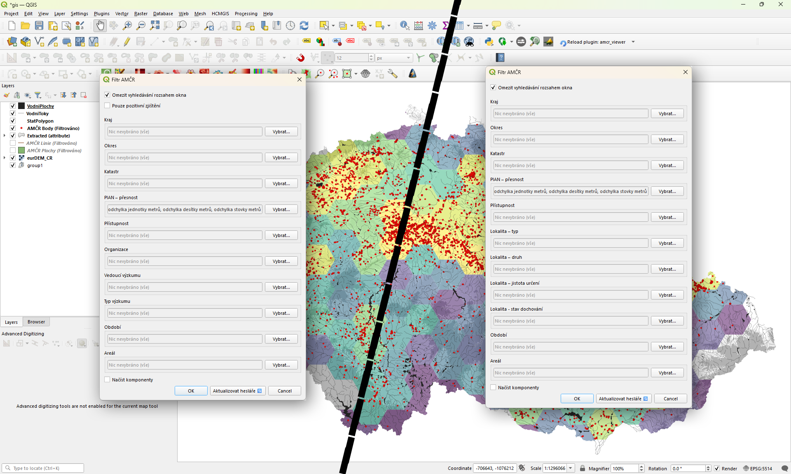
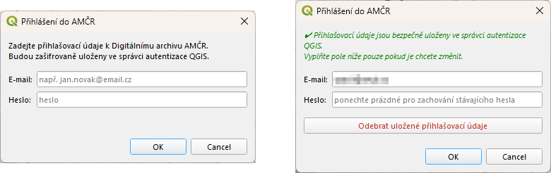

Cílem níže popsaných postupů je představit fungování QGIS pluginu [AMČR Viewer](https://plugins.qgis.org/plugins/amcr_viewer/){.external}, který slouží ke stahování archivovaných dat z **AMČR** a jejich zobrazení v prostředí **QGIS**.
Standardní možností exportu archivovaných dat z AMČR je využívání exportního dialogu Digiarchivu AMČR (viz [Hromadné sklízení prostorových dat Digitálního archivu AMČR pro GIS](https://zenodo.org/records/11490822){.external}). 
AMČR Viewer, stejně jako exportní okno, čerpá data z API Digiarchivu, nabízí ovšem jejich přímější implementaci a podrobnější metadata.


## Instalace pluginu

Nejjednodušším způsobem je instalace přímo přes repozitář pluginů QGIS. 

1. V hlavním menu v horní části okna QGIS otevřete nástroj `Plugins` → `Manage and Install Plugins...`.

[{width="66%" fig-align="center"}](figs/qv-plugins.png)

2. Vyhledejte `AMČR Viewer` a nainstalujte jej kliknutím na tlačítko `Install Plugin`.

[{width="60%" fig-align="center"}](figs/qv-install.png)

V prostředí QGIS se plugin zobrazí v podobě ikony {width="2.4%"}.


## Použití pluginu

Plugin umožňuje **načítání dat o *archeologických záznamech* (*akcích* a *lokalitách*)** a záznamech s nimi souvisejících (*PIAN*ech, *dokumentačních jednotkách* a *komponentách*). 
Základním prvkem je pro plugin ***[dokumentační jednotka](/slovnik/index.qmd#dokumentační-jednotky)***, součást *[archeologické akce](/slovnik/index.qmd#akce)* či *[lokality](/slovnik/index.qmd#lokality)*, která slouží jako unikátní záznam jak ve vztahu k *akci*/*lokalitě*, tak k příslušnému *[PIAN](/slovnik/index.qmd#pian)* (více k datové struktuře AMČR viz [Datový model](/o-systemu/datovy-model.qmd#evidence-archeologických-akcí)). 
V případě, že uživatel požádá o stahování komponent dotčených *akcí* či *lokalit*, je základním prvkem právě *komponenta*. 
Podobně jako v Digiarchivu lze i v pluginu filtrovat výsledky jak prostorově, tak pomocí metadat samotného archeologického záznamu, ale i jemu podřízených záznamů (zejména metadat *[komponenty](/slovnik/index.qmd#komponenty)*, jako jsou datace a typ areálu). 

### Postup načítání dat

Základní postup užívání AMČR Viewer je následující:

1. Ke spuštění pluginu slouží dvojice tlačítek `Stáhnout data akcí` {width="2.4%"} a `Stáhnout data lokalit` {width="2.4%"}, která by se měla po instalaci automaticky zobrazit v jedné z horních nástrojových lišt QGIS v podobě rozevíratelné nabídky. Pokud se tak nestalo, je možné plugin spustit z hlavního menu: `Plugins` → `AMČR Viewer` → `AMČR Viewer`.

2. Otevřené okno `Filtr AMČR` slouží k filtrování dat před jejich stažením. Je možné filtrovat pomocí:
    a) prostorových informací:
        - `Kraj`, `Okres`, `Katastr` (lze vybrat více možností),
        - `Omezit vyhledávání rozsahem okna` (tato možnost je ve výchozím nastavení vybrána z důvodu předejití neúmyslného načítání velkého množství dat),
        - `PIAN přesnost` (ve výchozím nastavení je zakázána možnost `poloha podle katastru`; lze vybrat více možností);
    b) údajů podmíněných typem dotazovaného záznamu:
        - administrativních informací:
            - `Organizace`, `Typ výzkumu`, `Vedoucí výzkumu` (lze vybrat více možností);
        - informací o lokalitě:
            - `Typ`, `Druh`, `Jistota určení`, `Stav dochování` (lze vybrat více možností);
    c) informací o nálezu:
        - `Pouze pozitivní zjištění` (relevantní pouze pro filtr *akcí*; vrátí pouze dokumentační jednotky, jejichž atribut `typ zjištění` = `pozitivní`),
        - `Období`, `Areál` (lze vybrat více možností);
    d) přístupnosti záznamu (`Přístupnost`; lze vybrat více možností).
    - Poslední možností dialogu je checkbox `Načíst komponenty`, který je ve výchozím nastavení vypnutý.

[{width="66%" fig-align="center"}](figs/qv-usage.webp)

3. Po potvrzení výběru dojde k načtení filtrovaných dat z API Digiarchivu AMČR do až tří dočasných vrstev (pro každý typ geometrie -- body, linie, polygony -- jedna vrstva). 
Pro trvalé uložení výsledků **je potřeba dočasné vrstvy uložit**. 
V opačném případě dojde po zavření QGISu ke ztrátě stažených dat.

### Přihlášení

V případě potřeby je možné se do pluginu přihlásit pomocí přihlašovacích údajů použitých pro přístup do Digitálního archivu AMČR.
Pro přihlášení klikněte v nabídce pluginu (pod tlačítky aktivující stahování *akcí* a *lokalit*) na tlačítko `Přihlásit se`, které otevře přihlašovací formulář.
Před prvním přihlášením bude QGIS žádat nastavení master hesla pro `QGIS Password manager`, pokud jste tak již neučinili dříve. 
Toto heslo nijak nesouvisí s AMČR a je na vašem uvážení, jaké heslo nastavíte. 
Po úspěšném nastavení master hesla se dialogové okno automaticky změní na okno pro přihlášení do Digiarchivu, kam již vkládáte své přihlašovací údaje pro Digiarchiv.
Tyto údaje jsou následně bezpečně uloženy v `QGIS Password manageru`, odkud si je plugin půjčuje pro komunikaci s Digiarchivem.
Plugin sám přihlášení obnovuje po otevření QGIS či po uplynutí časového limitu session.  
Pokud chcete uložené údaje odstranit, můžete tak učinit opět po kliknutí na tlačítko `Přihlásit se` a vybrání možnosti `Odebrat uložené přihlašovací údaje`.
K odhlášení dojde automaticky po vypršení session (po uplynutí časového limitu od posledního požadavku nebo po zavření QGIS).

[{width="66%" fig-align="center"}](figs/qv-login.webp)

### Aktualizace heslářů

V každém z filtračních oken je vedle tlačítek `OK` a `Cancel` ještě i možnost `Aktualizovat hesláře 🔄️`.
Plugin má z distribuce přiloženu sadu heslářů, není tedy nutné aktualizaci provádět hned po instalaci.
Možnost aktualizace ale zaručuje, že lokálně uložené hesláře budou odpovídat aktuálnímu stavu v AMČR, měl-li by se změnit. 
Aktualizace dává smysl zejména v případě hesláře osob (filtr `Vedoucí výzkumu`), neboť osoby v AMČR dynamicky přibývají. 

::: {.callout-note}
## Poznámka

Hesláře se aktualizují z AMČR OAI-PMH API, počítejte prosím s tím, že jejich stahování může trvat i několik minut. 
:::

### Datová struktura

Kvůli nutnosti dělit prvky podle typu geometrie musí plugin vykreslit načtená data ve třech různých vrstvách: `AMCR_{zaznam}_Body`, `AMCR_{zaznam}_Linie` a `AMCR_{zaznam}_Polygony`, přičemž položka `{zaznam}` odpovídá typu požadovaného archeologického záznamu `Akce`/`Lokalita`. 
V případě požadavku stažení komponent jsou součástí každé z vrstev navíc ještě pole `Komponenta`, `Areál` a `Období`.

Atributové tabulky jednotlivých vrstev obsahují následující informace:

```{r}
#| echo: false
#| message: false
#| layout-ncol: 2
#| tbl-cap: 
#|   - "Atributová tabulka vrstev akcí"
#|   - "Atributová tabulka vrstev lokalit"

library(knitr)

akce <- read.csv("tabs/akce.csv")
lokality <- read.csv("tabs/lokality.csv")

kable(akce)
kable(lokality)
```
*) Pole jsou přítomna pouze při požadavku na stažení dat komponent.

### Procházení a filtrování dat

Zobrazená data je možné procházet několika způsoby. Nejjedodušším nástrojem typu "pokus-omyl" je nástroj *Identifikovat prvky*. Po kliknutí na prvek se zobrzazí jak informace o příslušné *dokumentační jednotce* (*akci*/*lokalitě*), tak i ty z připojených *komponent*, pokud jsou na *dokumentační jednotku* tyto navázány.

[{width="66%" fig-align="center"}](figs/qv-identify-features.gif)

O něco systematičtějším způsobem je pak možnost *Filtr*, která umožňuje filtrovat výsledky jak pomocí atributů *akce*/*lokality*, tak pomocí atributů připojených komponent. Postup filtrování je zobrazen na animaci níže.

[{width="66%" fig-align="center"}](figs/qv-filtering.webp)

### Omezení

- Limit načítaných akcí je omezen na **20 000**. Doporučujeme využít filtrů pro předtřídění dat. V opačném případě načítejte data postupně po územních celcích (krajích či v některých případech okresech). Počty akcí podle krajů lze zkontrolovat v [Digiarchivu](https://digiarchiv.aiscr.cz/map?entity=akce&sort=datestamp%20desc&mapa=true&page=0){.external}.
- Při načítání komponent jsou prostorové prvky duplikovány -- každý prvek odpovídá jedné komponentě. Prostorové analýzy (plochy, počty) mohou být zkreslené.


## Zapojte se

V případě, že objevíte nějakou chybu, která nám unikla, či případně budete chtít přijít s nápadem na přidání nové funkce, využijte k tomu prosím tento [formulář](https://forms.gle/KVV8tftrEp1t7ocL7){.external} pro nahlášení problému, případně založte [GitHub issue](https://github.com/ARUP-CAS/aiscr-qgis-amcr-viewer/issues){.external}.