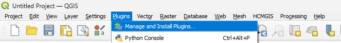
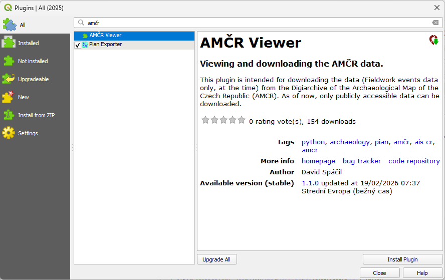
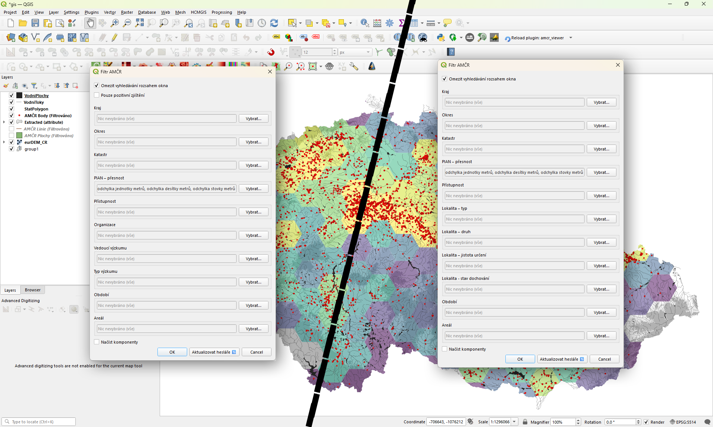
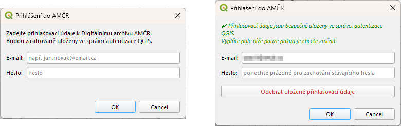

::: callout-note

Návod je platný pro verzi pluginu [v2.1.2](https://github.com/ARUP-CAS/aiscr-qgis-amcr-viewer/releases/tag/v2.1.2){.external}, přehled změn v jednotlivých verzích viz [Releases](https://github.com/ARUP-CAS/aiscr-qgis-amcr-viewer/releases){.external}.

:::

Cílem níže popsaných postupů je představit fungování QGIS pluginu [AMČR Viewer](https://plugins.qgis.org/plugins/amcr_viewer/){.external}, který slouží ke stahování archivovaných dat z **AMČR** a jejich zobrazení v prostředí **QGIS**.
Standardní možností exportu archivovaných dat z AMČR je využívání exportního dialogu Digiarchivu AMČR (viz [Hromadné sklízení prostorových dat Digitálního archivu AMČR pro GIS](https://zenodo.org/records/11490822){.external}). 
AMČR Viewer, stejně jako exportní okno, čerpá data z API Digiarchivu, nabízí ovšem jejich přímější implementaci a podrobnější metadata.


## Instalace pluginu

Nejjednodušším způsobem je instalace přímo přes repozitář pluginů QGIS. 

1. V hlavním menu v horní části okna QGIS otevřete nástroj `Plugins` → `Manage and Install Plugins...`.

[{width="66%" fig-align="center"}](figs/qv-plugins.png)

2. Vyhledejte `AMČR Viewer` a nainstalujte jej kliknutím na tlačítko `Install Plugin`.

[{width="60%" fig-align="center"}](figs/qv-install.png)

V prostředí QGIS se plugin zobrazí v podobě ikony {width="2.4%"}.


## Použití pluginu

Plugin umožňuje **načítání dat z vybraných modulů Digiarchivu (*Akce*, *Lokality* a *Samostatné nálezy*)** a záznamech s nimi souvisejících (*PIAN*ech, *dokumentačních jednotkách* a *komponentách*). 
Vykreslování záznamů z vyjmenovaných modulů respektuje [Datový model AMČR](/o-systemu/datovy-model.qmd#evidence-archeologických-akcí).

### Postup načítání dat

Základní postup užívání AMČR Viewer je následující:

1. Ke spuštění pluginu slouží trojice tlačítek `Stáhnout data akcí` {width="2.4%"}, `Stáhnout data samostatných nálezů` {width="2.4%"} a `Stáhnout data lokalit` {width="2.4%"}, která se po instalaci automaticky zobrazí v jedné z horních nástrojových lišt QGIS v podobě rozevíratelné nabídky. 
Pokud se tak nestane, je možné plugin spustit z hlavního menu: `Plugins` → `AMČR Viewer` → `AMČR Viewer`.
Nabídka dále obsahuje položku `Přihlásit se` (viz [Přihlášení](#přihlášení)) a položku `Nápověda AMČR Help`, která otevře tuto stránku.

2. Otevřené okno `Filtr AMČR` slouží k filtrování dat před jejich stažením. 
Je možné filtrovat pomocí polí vypsaných níže:

| Filtr | Akce | Lokality | Sam. nálezy |
|---|---|---|---|
| Omezit vyhledávání rozsahem okna | ✓ | ✓ | ✓ |
| Pouze pozitivní zjištění | ✓ | — | — |
| Pouze projektové akce | ✓ | — | — |
| Kraj | ✓ | ✓ | ✓ |
| Okres | ✓ | ✓ | ✓ |
| Katastr | ✓ | ✓ | ✓ |
| Přístupnost | ✓ | ✓ | ✓ |
| PIAN – přesnost | ✓ | ✓ | — |
| Organizace | ✓ | — | ✓ |
| Vedoucí výzkumu | ✓ | — | — |
| Typ výzkumu | ✓ | — | — |
| Datum — *Zahájení* / *Ukončení* | ✓ | — | — |
| Lokalita – typ | — | ✓ | — |
| Lokalita – druh | — | ✓ | — |
| Lokalita – jistota určení | — | ✓ | — |
| Lokalita - stav dochování | — | ✓ | — |
| Období | ✓ | ✓ | ✓ |
| Kategorie nálezu | — | — | ✓ |
| Druh nálezu | — | — | ✓ |
| Specifikace nálezu | — | — | ✓ |
| Okolnosti nálezu | — | — | ✓ |
| Nálezce | — | — | ✓ |
| Datum nálezu | — | — | ✓ |
| Areál | ✓ | ✓ | — |
| Načíst komponenty | ✓ | ✓ | — |

- U polí s výběrem lze vybrat více možností; pole, ve kterém není vybráno nic (`Nic nevybráno (vše)`), výsledky neomezuje,
- možnost `Omezit vyhledávání rozsahem okna` je ve výchozím nastavení vybrána z důvodu předejití neúmyslného načítání velkého množství dat,
- u položky `PIAN – přesnost` (relevantní pouze pro záznamy navázané na PIAN: *akce* a *lokality*) je ve výchozím nastavení zakázána možnost `poloha podle katastru`,
- možnost `Pouze pozitivní zjištění` je relevantní pouze pro filtr *akcí*; vrátí pouze dokumentační jednotky, jejichž atribut `typ zjištění` = `pozitivní`,
- možnost `Pouze projektové akce` vrátí pouze *akce* navázané na projekt,
- u polí s datem (`Datum` u *akcí*, `Datum nálezu` u *samostatných nálezů*) lze vyplnit jen jednu mez rozmezí, prázdné pole (`neomezeno`) znamená rozmezí otevřené z dané strany; rozmezí, jehož počáteční datum je pozdější než koncové, dialog nepřijme,
- u *akcí* a *lokalit* je poslední možností dialogu checkbox `Načíst komponenty`, který je ve výchozím nastavení vypnutý; jeho aktivací dojde k potenciálnímu znásobení výsledků podle počtu komponent na akci (dokumentační jednotku), na což dialog upozorní.

[{width="66%" fig-align="center"}](figs/qv-usage.webp)

3. Po potvrzení výběru dojde k načtení filtrovaných dat z API Digiarchivu AMČR do až tří dočasných vrstev (pro každý typ geometrie -- body, linie, polygony -- jedna vrstva). 
Pro trvalé uložení výsledků **je potřeba dočasné vrstvy uložit**. 
V opačném případě dojde po zavření QGISu ke ztrátě stažených dat.

### Přihlášení

Plugin je možné používat zcela anonymně. 
V tomto režimu vrací API Digiarchivu všechna data (odpovídající filtrům), která lze bez přihlášení zobrazit v [mapovém zobrazení Digiarchivu](https://digiarchiv.aiscr.cz/map?mapa=true&loc_rpt=48.5731315612793,12.112100601196289,51.0154914855957,18.76592254638672).
Tímto způsobem lze tedy zobrazit drtivou většinu *akcí* i *lokalit*, ne však *samostatných nálezů*.

V případě potřeby je možné se do pluginu přihlásit pomocí přihlašovacích údajů použitých pro přístup do Digitálního archivu AMČR.
Pro přihlášení klikněte v nabídce pluginu (pod tlačítky pro stahování dat) na tlačítko `Přihlásit se`, které otevře přihlašovací formulář `Přihlášení do AMČR`.
Do formuláře vyplňte e-mail a heslo, které používáte pro přístup do Digiarchivu.
Po potvrzení plugin údaje nejprve ověří přihlášením do Digiarchivu; nesprávné údaje se neuloží.
Pokud je server Digiarchivu nedostupný, plugin se zeptá, zda chcete údaje přesto uložit bez ověření.
Při prvním ukládání bude QGIS žádat nastavení master hesla pro `QGIS Password manager`, pokud jste tak již neučinili dříve (jinak vás může požádat o jeho zadání).
Toto heslo nijak nesouvisí s AMČR a je na vašem uvážení, jaké heslo nastavíte.
Přihlašovací údaje jsou následně bezpečně uloženy v `QGIS Password manageru`, odkud si je plugin půjčuje pro komunikaci s Digiarchivem.
Plugin sám přihlášení obnovuje po otevření QGIS či po uplynutí časového limitu session.
Pokud chcete uložené údaje změnit, otevřete znovu formulář tlačítkem `Přihlásit se`; e-mail je v něm předvyplněný a pole pro heslo lze ponechat prázdné, pokud se heslo nemění.
Pokud chcete uložené údaje odstranit, můžete tak učinit v tomtéž formuláři volbou `Odebrat uložené přihlašovací údaje`.
K odhlášení dojde automaticky po vypršení session (po uplynutí časového limitu od posledního požadavku nebo po zavření QGIS).

[{width="66%" fig-align="center"}](figs/qv-login.webp)

### Aktualizace heslářů

V každém z filtračních oken je vedle tlačítek `OK` a `Cancel` ještě i možnost `Aktualizovat hesláře 🔄️`.
Plugin má z distribuce přiloženu sadu heslářů, není tedy nutné aktualizaci provádět hned po instalaci.
Možnost aktualizace ale zaručuje, že lokálně uložené hesláře budou odpovídat aktuálnímu stavu v AMČR, měl-li by se změnit. 
Aktualizace dává smysl zejména v případě heslářů osob (filtry `Vedoucí výzkumu` a `Nálezce`), neboť osoby v AMČR dynamicky přibývají.

::: {.callout-note}
## Poznámka

Hesláře se aktualizují z AMČR OAI-PMH API, seznamy osob (`Vedoucí výzkumu`, `Nálezce`) z API Digiarchivu.
Počítejte prosím s tím, že jejich stahování může trvat i několik minut.
Aktualizace běží na pozadí jako úloha QGIS, kterou lze v případě potřeby zrušit; po jejím dokončení plugin zobrazí hlášení.
:::

### Datová struktura

Kvůli nutnosti dělit prvky podle typu geometrie musí plugin vykreslit načtená data ve třech různých vrstvách: `AMCR_{zaznam}_Body`, `AMCR_{zaznam}_Linie` a `AMCR_{zaznam}_Polygony`, přičemž položka `{zaznam}` odpovídá typu požadovaného záznamu `Akce`/`Lokalita`/`Samostatný_nález`.
Vrstva se vytvoří jen pro ty typy geometrie, které se ve výsledku vyskytují.
V případě požadavku stažení komponent (u *akcí* a *lokalit*) jsou součástí každé z vrstev navíc ještě pole `Komponenta`, `Areál` a `Období`.

Atributové tabulky jednotlivých vrstev obsahují následující informace:

```{r}
#| echo: false
#| message: false
#| layout-ncol: 3
#| tbl-cap: 
#|   - "Atributová tabulka vrstev akcí"
#|   - "Atributová tabulka vrstev lokalit"
#|   - "Atributová tabulka vrstev samostatných nálezů"

library(knitr)

akce <- read.csv("tabs/akce.csv")
lokality <- read.csv("tabs/lokality.csv")
sn <- read.csv("tabs/sn.csv")

kable(akce)
kable(lokality)
kable(sn)
```
*) Pole jsou přítomna pouze při požadavku na stažení dat komponent.

### Procházení a filtrování dat

Zobrazená data je možné procházet několika způsoby. 
Nejjednodušším nástrojem typu "pokus-omyl" je nástroj *Identifikovat prvky*. 
Po kliknutí na prvek se zobrazí jak informace o příslušné *dokumentační jednotce* (*akci*/*lokalitě*) či *samostatném nálezu*, tak i ty z připojených *komponent*, pokud jsou na *dokumentační jednotku* tyto navázány.

[{width="66%" fig-align="center"}](figs/qv-identify-features.gif)

O něco systematičtějším způsobem je pak možnost *Filtr*, která umožňuje filtrovat výsledky jak pomocí atributů *akce*/*lokality*/*samostatného nálezu*, tak pomocí atributů připojených komponent. 
Postup filtrování je zobrazen na animaci níže.

[{width="66%" fig-align="center"}](figs/qv-filtering.webp)

### Omezení

- Limit načítaných záznamů je omezen na **20 000**. 
Doporučujeme využít filtrů pro předtřídění dat. 
V opačném případě načítejte data postupně po územních celcích (krajích či v některých případech okresech). 
Počty akcí podle krajů lze zkontrolovat v [Digiarchivu](https://digiarchiv.aiscr.cz/map?entity=akce&sort=datestamp%20desc&mapa=true&page=0){.external}.
- Při načítání komponent jsou prostorové prvky duplikovány -- každý prvek odpovídá jedné komponentě. 
Prostorové analýzy (plochy, počty) mohou být zkreslené.


## Zapojte se

V případě, že objevíte nějakou chybu, která nám unikla, či případně budete chtít přijít s nápadem na přidání nové funkce, využijte k tomu prosím tento [formulář](https://forms.gle/KVV8tftrEp1t7ocL7){.external} pro nahlášení problému, případně založte [GitHub issue](https://github.com/ARUP-CAS/aiscr-qgis-amcr-viewer/issues){.external}.