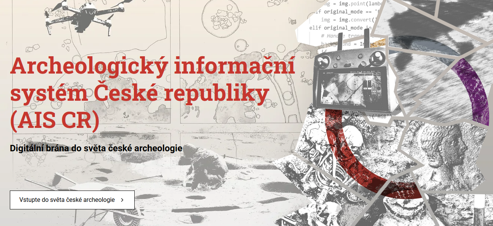
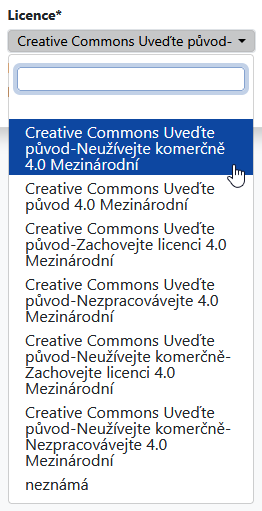

> Vážení uživatelé a uživatelky AMČR,
>
> přinášíme Vám zpravodaj **AMČR č. 14**, který představuje nové webové stránky a vizuální styl naší infrastruktury. 
> Dále dáváme do pozornosti sekci *Metodické pokyny a výklady* Dokumentace AMČR a stručně popisujeme kontroly, kterými prochází dokumenty (aj.) po odeslání do AMČR.
> Dokumentů se týká i to, že nově lze volit licenci, pod kterou budou zveřejněny v Digitálním archivu.
>
> Váš *tým* AIS CR...

## Nové weby AIS CR a AMČR

{width="60%" fig-align="center"}

V prosinci 2025 byla spuštěna nová podoba webových stránek [Archeologického informačního systému České republiky](https://www.aiscr.cz/){.external} a [Archeologické mapy České republiky](https://amcr-info.aiscr.cz/){.external}. 
Weby přinášejí modernější vzhled, přehlednější strukturu i příjemnější uživatelské prostředí. 
Oba weby spojuje jednotný vizuální styl, který vás bude i nadále provázet napříč komunikací infrastruktury AIS CR. 
Nové weby dále pomáhají propojovat služby AIS CR s jejich uživatelstvem a zpřístupňovat je tak, aby si v nich každá skupina našla to, co potřebuje. 
Cílem je nejen usnadnit práci s informacemi, ale také přispívat k ochraně a popularizaci archeologického dědictví. 
Bez jeho digitální dostupnosti a viditelnosti by totiž jen obtížně naplňovalo svůj potenciál a jeho výzkum a ochrana nacházely širší podporu.

Web AIS CR dostupný na [https://www.aiscr.cz/](https://www.aiscr.cz/){.external} nově obsahuje také blog. 
Podtitul *Archeodata po lopatě – příspěvky o archeologii, datech a světě AIS CR* jsme nezvolili náhodně. 
Má naznačit, že chceme fungování AIS CR přibližovat srozumitelně a přístupně – od novinek a zkušeností až po pohled do zákulisí naší práce. 
Sledujte [blog](https://www.aiscr.cz/#blog){.external} a dejte nám vědět, jak se nám to daří!

Web AMČR na adrese [https://amcr-info.aiscr.cz/](https://amcr-info.aiscr.cz/){.external} nabízí přehledný přístup k nástrojům Archeologické mapy, a to jak možností rychlého výběru podle vašeho záměru (např. Oznamujte stavby, Evidujte výzkumy apod.), tak i v podobě strukturovaného seznamu. 
Nechybí ani Aktuality a často kladené otázky. 
V Aktualitách najdete především upozornění na výpadky a plánované odstávky AMČR, případně další informace technického rázu či pozvánky na blížící se školení k AMČR-PAS, stejně jako doposud. 
V budoucnu plánujeme sjednotit aktuality napříč našimi službami, tj. na stránkách AMČR a v Digitálním archivu.

Součástí webu je také uživatelsky přehlednější podoba podstránky [AMČR-PAS](https://amcr-info.aiscr.cz/amcr-pas/){.external} (Portál amatérských spolupracovníků a evidence samostatných nálezů). 
Ta se věnuje principům spolupráce profesionální a amatérské komunity v rámci občanské vědy a fungování Portálu. 
Najdete tam často kladené otázky od veřejnosti i archeologické obce, relevantní odkazy na užitečné dokumenty, pomůcky a nástroje (např. manuál pro focení, měřítka aj.) i vzorové dokumenty ke stažení.
Oba weby jsou dostupné také v anglické verzi.

> Budeme rádi, když nové weby vyzkoušíte a věříme, že zde naleznete užitečný obsah a budete se k nim rádi vracet!
>
> Když najdete něco, co by Vám na webech chybělo, nebo narazíte na chybu, dejte nám prosím vědět na [ amcr@arup.cas.cz](mailto:amcr@arup.cas.cz) a/nebo [ amcr@arub.cz](mailto:amcr@arub.cz).


## Sekce Metodické pokyny a výklady v dokumentaci AMČR

V sekci [Metodické pokyny a výklady](/metodika/index.qmd) naleznete dokumenty nastavující základní metodické přístupy aplikované v AMČR a agendách souvisejících s jejím užíváním, vč. doporučení k výkladu existujících předpisů a regulací.

[Metodické doporučení pro administraci projektů v AMČR](/metodika/administrace-proj.qmd) je detailněji popsáno níže, dále sekce obsahuje [Pravidla pro podání nálezové zprávy o terénním archeologickém výzkumu](/metodika/pravidla-nz.qmd) a [Pravidla pro badatelské archeologické výzkumy](/metodika/badatelske-vyzkumy.qmd).
K AMČR-PAS se vztahují [Metodický výklad AMČR-PAS v kontextu zákona č. 20/1987 Sb., o státní památkové péči](/metodika/amcr-pas.qmd) a [Stanovisko MK ČR k AMČR-PAS ](/metodika/docs/AMCR-PAS_MK-CR_stanovisko.pdf).
V neposlední řadě jsou zde také [Informace k Dohodám o využívání AMČR](/metodika/dohody.qmd) a vzory jejich dodatků.

### Administrace projektů v AMČR a její návaznost na zákonné povinnosti

AMČR jako základní oborový nástroj archeologické památkové péče plní dva hlavní účely – uchovat informace o archeologickém dědictví České republiky a umožnit subjektům archeologické památkové péče plnit zákonné povinnosti jednoduchým, transparentním a efektivním způsobem. 
Plnění těchto povinností, vyplývajících primárně ze [zákona č. 20/1987 Sb., o státní památkové péči](https://www.zakonyprolidi.cz/cs/1987-20){.external}, ve znění pozdějších předpisů a příslušných [Dohod o rozsahu a podmínkách provádění archeologických výzkumů](/metodika/dohody.qmd), je integrálním předpokladem ochrany archeologického dědictví České republiky.

V návaznosti na novelu zákona o státní památkové péči platnou od 1. 1. 2025, proto Archeologické ústavy připravily nové metodické doporučení pro administraci projektů v AMČR. 
Doporučení usazuje administraci projektů do kontextu zákona a vysvětluje, jak se jednotlivé úkony pojí se zákonnými povinnostmi. 

Doporučení mimo jiné

- adresuje oznamování stavební činnosti stavebníky a zápis záměrů oprávněnými organizacemi; 
- objasňuje proč je přihlašování projektů důležité a proč z něj oprávněné organizaci neplynou žádné povinnosti směrem k stavebníkovi;
- zdůrazňuje potřebu evidence zahájení a ukončení výzkumu v terénu;
- popisuje proces archivace projektu a rušení projektu. 

Metodické doporučení nezavádí žádné nové povinnosti, ale administrace projektů v souladu s ním zaručuje dodržení všech zákonných povinností. 
**Včasná administrace projektů v AMČR navíc zlepšuje komunikaci se stavebníky a zvyšuje transparentnost archeologické památkové péče.**

Viz [Metodické doporučení pro administraci projektů v AMČR](/metodika/administrace-proj.qmd) pro podrobnější informace.


## Postup kontroly záznamů při archivaci a způsoby jejich vracení

> *Pro lepší pochopení co se s dokumenty a ostatními daty děje po odeslání v AMČR Vám přinášíme stručný popis následných kontrol, které provádějí naši archiváři a archivářky.*

Po uzavření projektu dochází nejprve ke kontrole formální shody informací uvedených na kartě projektu a informací uvedených v popisu připojené archeologické akce. 
Jelikož popis projektu obsahuje zejména administrativní data od oznamovatelů, nemusí se pochopitelně zcela shodovat s informacemi v archeologické akci, která obsahuje popis toho, jak akce probíhala skutečně v terénu. 
Mělo by být nicméně zřejmé, že obě části záznamu patří k sobě a v případě výrazných rozdílů by měly být tyto rozdíly v AMČR okomentovány. 
V momentu archivace jsou pak automaticky anonymizovány údaje o oznamovateli projektu a jsou smazány soubory ze sekce `Projektová dokumentace` (u projektů typu badatelský a průzkum je projektová dokumentace ponechána).

V rámci archeologické akce je před archivací kontrolován zejména její faktický obsah, úplnost a vzájemná kompatibilita jednotlivých částí. 
Tedy zda je akce odpovídajícím způsobem popsána, zda má správně zvolené dokumentační jednotky a zda k nim přidělené PIANy odpovídají popsanému rozsahu a charakteru akce. 
V případě pozitivních akcí prochází kontrolou také komponenty připojené k dokumentačním jednotkám a to, zda odpovídají informacím uvedeným v připojené nálezové zprávě či jiném relevantním dokumentu. 
V případě nedostatků je akce vrácena autorovi k opravě či doplnění.

Kontrolou prochází také dokumenty připojené k akci. 
Pokud se jedná o nálezovou zprávu, vychází archiváři a archivářky při kontrole z [Pravidel pro podání nálezové zprávy](/metodika/pravidla-nz.qmd). 
U jiných typů dokumentů (např. expertních posudků) vychází z obvyklé podoby těchto dokumentů, kdy je při kontrole důraz kladen především na úplnost a přehlednost obsažených informací. 
V případě zjištěných nedostatků je dokument spolu s akcí vrácen k opravě či doplnění (v případě rozsáhlejších nedostatků obdržíte e-mail s podrobnějšími informacemi). 
Pokud je dokument v pořádku, projde tzv. optimalizací zajišťující jeho správné otevření i po dlouhé době a je archivován. 

Následně je archivována také akce a po archivaci poslední akce i celý projekt. 
Po archivaci se všechny záznamy promítnou do [Digitálního archivu](https://digiarchiv.aiscr.cz/){.external}, kde jsou s odpovídající přístupností zveřejněny.

U samostatných akcí při kontrole pochopitelně odpadá část s informacemi obsaženými v projektu, ale kontrola samostatné akce probíhá podle stejných principů jako kontrola projektové akce.
Stejně tak je jejich specificitě přizpůsobena kontrola záznamů v AMČR-PAS, kde je specifická kontrola přikládaných fotografií a nálezová zpráva má pro tyto účely upravenou podobu. 
Principy kompletnosti a přehlednosti údajů jsou však zachovány i zde.


## Možnost volby licence u dokumentů

V AMČR je nově možné volit licenci, pod kterou budou dokumenty zveřejněny v [Digitálním archivu](https://digiarchiv.aiscr.cz/){.external}.
Doposud byla licence přednastavena dle licenční smlouvy mezi Archeologickými ústavy AV ČR a oprávněnou organizací, která dokument nahrála.
Tuto licenci může nyní uživatel či uživatelka změnit na jinou [*Creative Commons*](https://creativecommons.org/cc-licenses/){.external} licenci, viz tabulka níže.

Dokumenty z archivů Archeologických ústavů AV ČR jsou zpravidla zveřejněny pod licencí [CC BY-NC 4.0 Int.](https://creativecommons.org/licenses/by-nc/4.0/deed.cs){.external}.
Dokumenty, u kterých je autorství nejisté nebo jinak problematické pak mají v políčku licence položku `neznámá`.
Do budoucna doporučujeme volit licenci **CC BY 4.0 Int.**, která je permisivní a umožňuje široké využití nahraných dat a dokumentů, přičemž zachovává povinnost uvést autora a zdroj díla.
Tato licence jako jediná plně odpovídá požadavkům [zákona č. 328/2025 Sb., o výzkumu, vývoji, inovacích a transferu znalostí](https://www.zakonyprolidi.cz/cs/2025-328){.external} na otevřená data.

::: {.column-margin}
{width="60%" fig-align="center"}
:::

Nově je možné volit mezi následujícími [*Creative Commons*](https://creativecommons.org/cc-licenses/){.external} licencemi:

```{r}
#| tbl-cap: "Licence"
cc <- read.csv("../amcr/tabs/licenses.csv", tryLogical = FALSE)

cc |> 
  knitr::kable()
```

Prvky *Creative Commons* licencí jsou následující:

- `BY` -- *Attribution* / Uveďte původ -- vždy je třeba uvést autora, název, zdroj díla a licenci;
- `NC` -- *Non Commercial* / Neužívejte dílo komerčně -- dílo nesmí být použito pro komerční účely, tedy pro účel generování zisku;
- `ND` -- *No Derivatives* / Nezpracovávejte -- dílo nesmí být upravováno, tedy ani nesmí být vytvářena odvozená díla;
- `SA` -- *Share Alike* / Zachovejte licenci -- pokud dílo upravíte, musíte své dílo licencovat stejnou licencí.

> O otevřených licencích, licencování dat apod. se můžete více dozvědět na webu k [Open Science](https://openscience.cz/){.external} spravovaném *Národní technickou knihovnou*, viz [https://openscience.cz/cs/open-science/komponenty/open-licencing/](https://openscience.cz/cs/open-science/komponenty/open-licencing/){.external} nebo na webu [Open Science](https://openscience.lib.cas.cz/){.external} provozovaném *Knihovnou Akademie věd ČR*, viz [https://openscience.lib.cas.cz/open_access/verejne-licence/](https://openscience.lib.cas.cz/open_access/verejne-licence/){.external}.